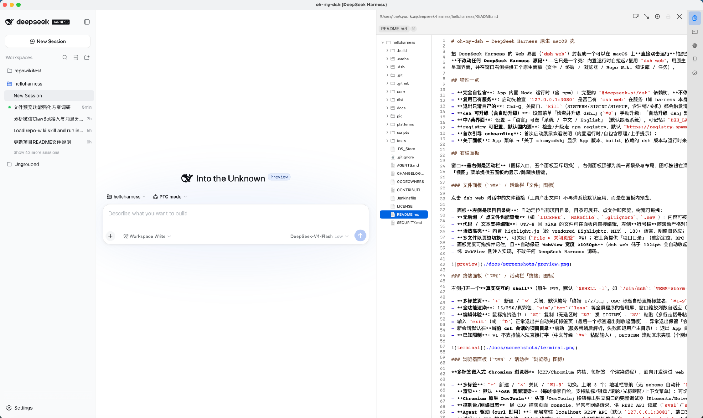
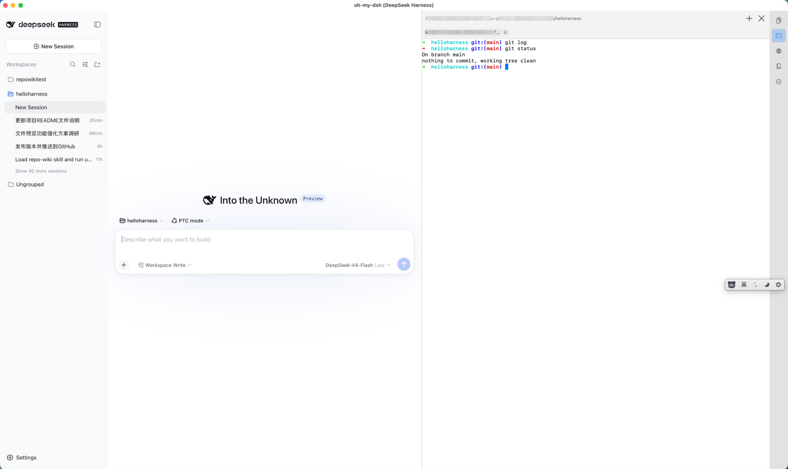
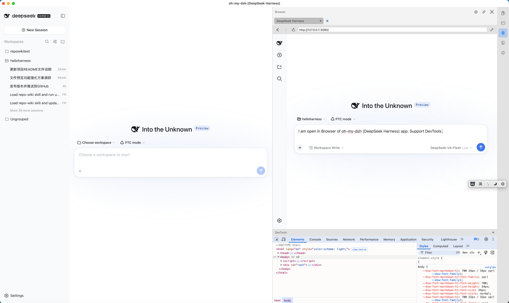
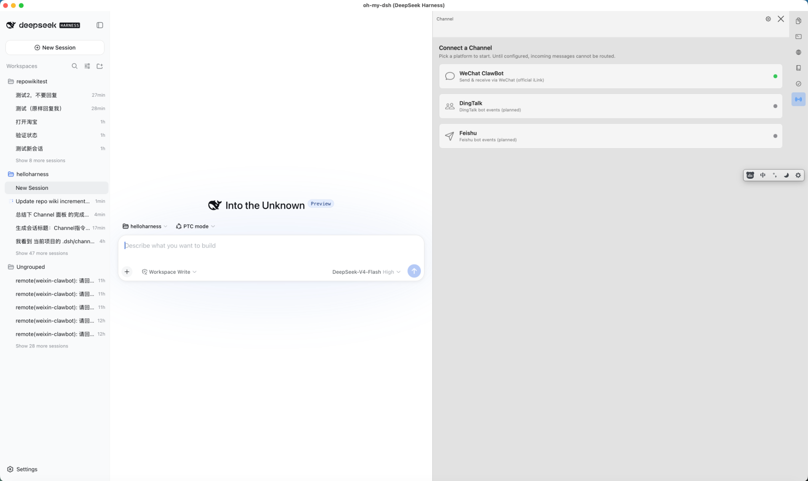

# oh-my-dsh — DeepSeek Harness 原生 macOS 壳

把 DeepSeek Harness 的 Web 界面（`dsh web`）封装成一个可以在 macOS 上**直接双击运行**的原生 App。
**不改动任何 DeepSeek Harness 源码**——它只是一个壳：内置运行时自拉起/复用 `dsh web`，用原生 `WKWebView`
呈现界面，并在窗口右侧提供六个原生面板（文件 / 终端 / 浏览器 / Repo Wiki 知识库 / 任务 / 通道）。

## 特性一览

- **完全自包含**：App 内置 Node 运行时（含 npm）+ 完整的 `@deepseek-ai/dsh` 依赖树，**不依赖本机安装的 node 或 dsh**，拿到即可用（全新机器也能跑）；
- **复用已有服务**：启动先检查 `127.0.0.1:3080` 是否已有 `dsh web` 在服务（如 harness 本身正在运行）→ **复用**，不重复启动；否则用内置运行时**自己拉起**（端口被占用自动换空闲端口），就绪后装进原生窗口；
- **退出只清自己的**：Cmd+Q、关窗口、`kill`（SIGTERM/SIGINT/SIGHUP，含注销/关机）都会触发清理，关掉**自己拉起的**服务（优雅退出，3 秒内未退出则 SIGKILL），绝不干扰外部实例；
- **dsh 可升级（含自动升级）**：设置菜单「检查并升级 dsh…」(`⌘U`) 手动升级；「自动升级 dsh」默认开启，每次启动最多检查一次（24h 节流），发现新版自动用内置 npm 原地升级；
- **中/英界面**：设置 →「语言」可选「系统 / 中文 / English」（默认跟随系统），可记忆；`DSH_LANG=zh|en` 强制指定；切换联动刷新 dsh web 页面语言（会话在服务端不受影响）；
- **registry 可配置，默认国内源**：检查/升级走 npm registry，默认 `https://registry.npmmirror.com`，可在「设置 dsh registry…」里改（运行期），构建期用 `DSH_NPM_REGISTRY` 覆盖；
- **首次引导 onboarding**：首次启动展示欢迎说明（内置运行时/自包含原理/上手提示）；
- **关于面板**：App 菜单 →「关于 oh-my-dsh」显示 App 版本、build、依赖的 dsh 版本与运行时来源、Node 版本+路径、dsh registry。
- **通道面板（远程驱动）**：绑定微信个人号（官方 iLink 协议），在微信里发消息 / 斜杠指令远程驱动 dsh 干活——消息路由到项目会话、结果回复回微信；扫码登录、项目开关、会话列表均在面板内完成。

## 右栏面板

窗口**最右侧是活动栏**（图标入口，六个面板互斥切换），右侧面板顶部为统一背景条与布局，图标按钮在深浅色下均可见。
「视图」菜单提供六面板的显示/隐藏快捷键。

### 文件面板（`⌥⌘P` / 活动栏「文件」图标）

点击 dsh web 对话中的文件链接（工具产出文件）不再弹系统默认应用，而是在面板内预览。

- 面板**左侧是项目目录树**：自动定位当前项目目录，目录可展开、点文件即预览，树宽可拖拽；
- **无后缀 / 点文件也能查看**（如 `LICENSE`、`Makefile`、`.gitignore`、`.env`）：内容可被 UTF-8 解码且非二进制即按文本预览；
- **代码 / 文本支持编辑**：UTF-8 且 ≤2MB 的文件可在面板内直接编辑，左侧**行号栏**随滚动严格对齐，头部「保存」按钮 + `File ▸ 保存`（⌘S）原子写回；未保存时页签文件名后显示 `*`，保存后消失；
- **语法高亮**：内置 highlight.js（经 vendored Highlightr，MIT），180+ 语言，明暗自适应；图片 / PDF / 文件夹列表 / 未知类型（图标 + 元数据）按类型预览；
- **多文件以页签切换**，可关闭（`File ▸ 关闭页签` ⌘W）；右上角提供「项目目录」（重新定位，RPC 失败时回退手动选文件夹）、「保存」「在默认应用中打开」「在 Finder 中显示」「关闭」；
- 面板宽度可拖拽并记住，且**自动保证 WebView 宽度 ≥1050pt**（dsh web 低于 1024pt 会自动收起左侧会话栏）；
- 纯 WebView 侧注入实现，不改任何 DeepSeek Harness 源码。



### 终端面板（`⌥⌘T` / 活动栏「终端」图标）

右侧打开一个**真实交互的 shell**（原生 PTY，默认 `$SHELL -l`，如 `/bin/zsh`；`TERM=xterm-256color`）。

- **多标签页**：`+` 新建 / `✕` 关闭，默认编号「终端 1/2/3…」，OSC 标题自动更新标签名；`⌘1-9` 直切、`⌘⇧[` / `⌘⇧]` 循环切换；
- **全功能渲染**：16/256/真彩色、`vim`/`top`/`less` 等全屏程序的备用屏、窗口缩放列数自适应（`tput cols`）；
- **编辑体验**：鼠标拖拽选中 + `⌘C` 复制（无选区时 `⌘C` 发 SIGINT）、`⌘V` 粘贴（多行走括号粘贴，不会误执行）、`⌘A` 全选、`⌘K` 清屏、触控板滚动查看历史；
- 输入 `exit`（或 `⌃D`）正常退出并自动关闭标签页（最后一个标签退出则收起面板）；异常退出保留「会话已结束 + 重启」以便查看错误；
- 新会话默认在**当前 dsh 会话的项目目录**启动（服务就绪后解析，失败回退用户主目录）；退出 App 自动终止所有会话；
- **已知限制**：v1 不支持输入法直接打字（中文等经 `⌘V` 粘贴输入）、DECSTBM 滚动区未实现（个别全屏程序可能显示异常）、组合表情/零宽连接符按近似宽度渲染、会话不跨 App 重启保留。



### 浏览器面板（`⌥⌘B` / 活动栏「浏览器」图标）

**多标签嵌入式 Chromium 浏览器**（CEF/Chromium 内核，每标签一个渲染进程），面向开发调试 web 页面与 Agent 排查网页问题。

- **多标签**：`+` 新建 / `✕` 关闭 / `⌘1-9` 切换，上限 8 个；地址栏导航（无 scheme 自动补 `https://`）、后退/前进/刷新·停止、标签标题随页面更新；启动恢复上次 URL；
- **渲染**：默认 **OSR 离屏渲染**（每帧像素自绘，支持鼠标/键盘/滚轮/光标跟随/上下文菜单）；可切窗口化——`defaults write com.ohmydsh.app browserRenderMode -string windowed`；
- **Chromium 原生 DevTools**：头部「DevTools」按钮弹出独立窗口的完整调试器（Elements/Network/Console/Sources）；
- **控制台/网络日志**：经 CDP 捕获页面 console、异常与网络请求，供 REST API 读取（`eval`/`screenshot` 也走 CDP；CDP 端口默认 `9333`，`DSH_CDP_PORT` 覆盖）；
- **Agent 驱动（curl 即用）**：壳层常驻 localhost REST API（默认 `127.0.0.1:3081`，端口文件 `~/.dsh/browser-api.port`）——`status` / `open` / `tabs` / `back` / `forward` / `reload` / `stop` / `eval` / `console` / `console/clear` / `screenshot`(PNG) / `hide`，外加 QA 端点 `debug` / `hierarchy`；Agent 驱动时面板自动展开，截图可存工作区供读图/分享；配套技能 `web-dev-tools`（App 启动时安装到全局 `$DSH_HOME/skills/web-dev-tools/SKILL.md`，model+user 可调用）开箱即用；
- **说明**：CEF 构建体积约 +320MB/架构；Chromium 使用模拟钥匙串（`use-mock-keychain`，不弹密码框、不存网页密码）；profile 数据收在 `~/.dsh/browser/`；随包分发 5 个 helper app（base/Alerts/GPU/Plugin/Renderer）；集成细节见 `docs/plans/BROWSER_PLAN-browser-panel.md`。



### Repo Wiki 知识库面板（`⌥⌘W` / 活动栏「知识库」图标）

让 dsh 代理维护一份**随代码演进的结构化 markdown 知识库**（`.dsh/wiki/`，可随仓库提交/共享），新会话不再盲目重新探索代码库。

- **生成/更新**：右上「+」一键让 dsh 代理执行 `repo-knowledge` skill（App 启动时安装到全局 `$DSH_HOME/skills/repo-knowledge/SKILL.md`）——初始生成（index/overview/architecture/modules/data-model/conventions/tasks）或增量更新（只重写受影响页面）；经 `session.create` + `session.prompt`（queue 模式）触发，不阻塞对话，生成会话在 dsh web 左侧可见、可取消；状态条显示进度；
- **浏览**：左侧页面树（分组、过期/手动徽标）+ 右侧渲染后的 markdown（标题/粗斜体/代码/列表/链接，软换行保真）+ 反向链接区 + `dshwiki://` 页内跳转；标题过滤搜索；
- **维护**：陈旧检测（页面 `sources` 比 `updated` 新 → 标 ⚠）；`manual: true` 页面代理绝不覆盖（标 ✎）；可选写入项目根 `AGENTS.md` 注册块（设置开关，默认关）；「自动更新知识库」（默认关，≥3 页过期且 index 超 1 小时才触发，每小时最多一次）；wiki 根目录可选「仓库内 `.dsh/wiki`」或「`DSH_HOME` 私有」；
- **提交**：生成更新完成后自动 `git add .dsh/wiki` + commit（不 push；维护代理主提交，`WikiAutoCommit` 兜底）；
- 设计文档：`docs/repo-wiki-design.md`。**已知限制**：v1 搜索为标题过滤（无正文/语义检索）；知识由代理生成，质量取决于 dsh 代理能力。

### 任务面板（`⌥⌘J` / 活动栏「任务」图标）

由 **GitHub issue 驱动**的串行任务流水线：识别当前工作区仓库 → 列出 open issues → 点「处理」自动走完整闭环。

- **行内详情**：单击 issue 行展开（状态/标签/分支/PR/错误 + 正文，可滚动，底部固定操作按钮）；按仓库/标签自动切分支（feature → `feature/issue-N`，bug → `fix/issue-N`）；
- **一键流水线**：`checkout main → pull → checkout -b <分支> → dsh 会话 → issue-resolve skill 修复 → 推送 → 开 PR`，全程**串行**（「全部处理」依次入队）、可追溯（会话/分支/PR 全保留）、**重启可恢复**（关联索引 `.dsh/tasks/index.json` + 本机 `local.json`）；
- **评论并关闭 Issue**：任务完成后在展开区手动触发，预填 PR 引用，确认后 POST 评论 + 关闭 issue；
- **失败处理**：会话失败/超时（30min）/分支未推送/PR 失败各有明确状态与错误提示，可 Retry；取消走 `session.cancel`；
- **GitHub token（按仓库作用域）**：面板「配置 GitHub Token」**同时写** Keychain 专属与文件专属 `~/.dsh/tokens/<owner>-<repo>`（chmod 600，App 与外部工具/代理共用）；解析优先级：文件专属 → 文件通用 `~/.dsh/gh-token` → Keychain 专属 → Keychain 通用；公开仓库无需 token，私有仓库拉取/开 PR/评论关闭需要；
- 工作区非 GitHub 仓库时诚实显示空态（不替换为其他已注册工作区）；切换到不同仓库先清空旧列表再重载。

### 通道面板（`⌥⌘H` / 活动栏「通道」图标）

把微信个人号接入 dsh，**在微信里远程驱动 dsh 干活**：发消息 → 路由到项目会话 → 结果回复回微信。

- **接入向导**：内置平台卡片（微信 ClawBot / 钉钉 / 飞书，带实时连接状态徽标）；微信扫码登录**在面板内渲染二维码**（不弹浏览器），登录态落 `~/.dsh/channels/<id>.json`（文件优先，chmod 600）；
- **项目视图**：当前项目可用通道开关（启用状态存全局 `~/.dsh/channels/<channelId>.workspaces.json`，project=workspace，见 `docs/channel-project-switch.md`）。开关**真正门控路由**：普通消息 / `/new` 路由到未启用该通道的 workspace → 回「该项目未启用该通道」、不建会话；`/workspaces` 只列已启用项。会话列表：通道标题行展示「图标 + 平台名 (channelId) + 会话数」、启用开关靠右，整行独立背景；每条会话独立区块，标题可点开/收起，消息按对话气泡展示（提问靠右、回复靠左）；顶部「全局配置」随时重开；
- **微信内斜杠指令**：`/help` `/ping` `/status`（全局）；工作区指令 `/workspaces`(`/wks`)、`/sessions`(`/ses`)（无内容列出 / 有内容切换，等同 `#wN`/`#sN`）、`/new [内容]`（统一回 `创建新会话 #sN (sessionId)`，无内容建占位 `New Session`（dsh 标题由 dsh web 按首条消息自动命名）等首条消息激活、有内容 prompt=内容并回推答案）；快捷指令 `#w1`/`#s1…`（切项目/会话，均按目标/当前 workspace 是否启用该通道**门控**：未启用回「该项目未启用该通道」）与 #tag 路由（如 `#w1 帮我看看`）；
- **消息分发**：路由优先级（显式会话绑定 > 关键词 > 默认兜底），未绑定项目回复提示不静默；同会话串行、跨会话可并发（jobqueue）；
- **会话驱动**：conversationId → dsh 会话映射（多轮对话续接，`/new` 另起），`/new` 后绑定会话到 conversation、下一条普通消息复用而非新建；经 `session.create` + `session.prompt`（queue）驱动，**生成时回微信原生「正在输入…」(sendTyping)，完成后回推答案**；
- **可靠性**：官方 iLink 协议**严格串行长轮询**（修复重复回复）；断线/鉴权失效（-14）归一到统一状态机，受控重连/重新扫码；启动自动拉起 listener、退出清理、同通道去重；
- **全局存储**：会话映射与消息日志归档到全局 `~/.dsh/channels/`（按 channelId/workspaceKey/sessionId 分桶）；「项目开关」关联存全局 `~/.dsh/channels/<channelId>.workspaces.json`（见 `docs/channel-storage.md`、`docs/channel-project-switch.md`）；
- **当前限制**：钉钉/飞书仅展示卡片（适配器待实现）；
- 设计与指令清单：`docs/channel-design.md`、`docs/channel-commands.md`、`docs/channel-status.md`、`docs/channel-project-switch.md`。



## 产物

```
dist/oh-my-dsh.app                    编译好的原生 App（arm64，ad-hoc 签名，含内置运行时 + CEF）
dist/oh-my-dsh-<version>-arm64.pkg    安装包（装到 /Applications，版本号随 git tag）
dist/oh-my-dsh-<version>-arm64.dmg    拖拽安装镜像（把 App 拖进 Applications）
```

> 版本号由 git tag 驱动（见「构建」）；发布产物（含 SHA-256SUMS）见 GitHub Releases。

## 安装到 Applications

**方式一：安装包（推荐）**

```bash
open "dist/oh-my-dsh-<version>-arm64.pkg"
```

跟随安装器向导即可（会要求输入管理员密码）。安装器带 preinstall 脚本，重装前自动移除旧版本。
由于是本地构建、未公证，首次安装时 macOS 可能提示"无法验证开发者"——右键 →「打开」，或在
系统设置 → 隐私与安全性 中允许即可。

**方式二：拖拽镜像**

```bash
open "dist/oh-my-dsh-<version>-arm64.dmg"
```

把 `oh-my-dsh.app` 拖进 `Applications` 文件夹。

**构建安装包**（基于已构建的 `dist/oh-my-dsh.app`）：

```bash
./platforms/macos/make-pkg.sh   # 生成 arm64 的 .pkg 与 .dmg
```

## 环境要求

- 运行：macOS 13+（Apple Silicon）。**无需安装 Node、无需安装 dsh**。
- 构建：需要 Xcode Command Line Tools、curl、python3，以及网络（下载 Node + 从 registry 装 dsh；浏览器面板需先经 `build-cef.sh` 构建 CEF）。

## 构建

```bash
./platforms/macos/build-app.sh --prefetch  # （可选）先预下载 Node + 预装 dsh 到 .cache/，不产出 App
./platforms/macos/build-app.sh             # 全量构建 → dist/oh-my-dsh.app（复用 .cache/，无需再联网）
```

内置运行时是**构建时现做**的，不复制本机的任何 node/dsh 文件：

1. **下载 Node**：默认从国内镜像 `npmmirror.com/mirrors/node` 下载 `darwin-arm64` tarball
   （自动选最新 LTS，失败自动回退 nodejs.org），用官方 `SHASUMS256.txt` 校验 SHA-256 后，
   把 `bin/node` 和 `lib/node_modules/npm`（升级功能要用）嵌入 `Contents/Resources/runtime/`；
2. **安装 dsh**：用刚下载的 Node 自带 npm，在 `Contents/Resources/runtime/dsh` 里执行
   `npm install @deepseek-ai/dsh@<版本>`（默认版本，含其全部依赖闭包），默认走国内 npm 源
   `registry.npmmirror.com`（失败自动回退 npmjs.org）。

**Node 选择策略（运行期）**：`DSH_NODE` 显式指定 > 系统 node（PATH→nvm current→nvm default→nvm 最新→Homebrew，
取**通过版本门槛** `≥22.0.0` 者，`DSH_NODE_MIN` 可覆盖）> 内置 node 兜底；dsh web 子进程经登录 shell 合并用户 PATH。

构建变量：

| 变量 | 默认 | 作用 |
|---|---|---|
| `DSH_NODE_VERSION` | 自动检测最新 LTS | 指定下载的 Node 版本，如 `v22.23.2` |
| `DSH_PACKAGE_SPEC` | `@deepseek-ai/dsh@<默认版本>` | 传给 `npm install` 的包说明，如 `@deepseek-ai/dsh@latest` |
| `DSH_NODE_MIRROR` | `https://npmmirror.com/mirrors/node` | Node 下载镜像 |
| `DSH_NPM_REGISTRY` | `https://registry.npmmirror.com` | npm registry（构建期装 dsh 用） |
| `DSH_ARCH` | `uname -m` | 目标架构：`arm64` / `x86_64`（CI 构建 arm64，release 构建 arm64 + x86_64；不再出 universal） |
| `DSH_DEV_BUILD` | `0` | `1` 打包**开发版**（Info.plist 写 `DSHDevBuild=1`）：运行时自动用独立 CEF profile `~/.dsh/browser-dev` 并跳过单实例退出，可与已安装正式版并存测试 |
| `DSH_CEF_VERSION` | build-cef.sh pin 的版本 | 浏览器面板的 CEF/Chromium 版本（如 `150.0.18+gdb11278+chromium-150.0.7871.213`） |

构建缓存：Node tarball、npm 缓存、已构建的运行时与 CEF 产物存放在 `.cache/`（按架构分目录，不随 `.build/` 清除）；
相同组合会直接复用，重建只需几十秒。网络不可用时，会用缓存的 Node tarball 推导版本继续构建。

## 运行

```bash
open "dist/oh-my-dsh.app"
```

或者直接双击 `dist/oh-my-dsh.app`。

- 界面用系统 WebKit 渲染，与 Safari 同引擎；窗口标题固定为 `oh-my-dsh (DeepSeek Harness)`；
- 外部链接、`target=_blank` 会交给默认浏览器打开，不会在壳内跳走；文件下载走原生「另存为」对话框（`WKDownload`）；
- **菜单**：App 菜单（关于/隐藏/退出）、编辑菜单（`⌘C/V/X/A/Z` 路由到 WebView 首响应者）、视图菜单（六面板切换）、设置菜单（`⌘,` 设置窗口 / `⌘U` 检查并升级 dsh / `⌘L` 打开日志文件夹 / dsh 设置 / registry / 自动升级 / wiki 设置组 / 语言子菜单 / 外观子菜单）；
- 首次启动若被 Gatekeeper 拦（"无法验证开发者"），右键 App →「打开」即可（本地构建，无公证）。

## dsh 升级

- **手动**：设置菜单 →「检查并升级 dsh…」(`⌘U`)，对比 registry 最新版，有新版则用内置 npm 原地升级并提示；
- **自动**：设置菜单 →「自动升级 dsh」开关（默认开），每次启动自动检查（24 小时内最多一次），发现新版本在启动服务前先升级；
- 升级只作用于**内置运行时**（`Contents/Resources/runtime/dsh`），绝不碰系统安装的 dsh；
- 升级日志见 `~/Library/Logs/oh-my-dsh/app.log`（`auto-upgrade: …` 行）；
- 注意：升级会改写 App 包内文件，ad-hoc 签名因此失效，但本地运行不受影响；重新 `./platforms/macos/build-app.sh` 可还原干净包。

## 退出行为说明

| 场景 | 行为 |
|---|---|
| App 自己拉起了服务 | 退出时**关闭**（SIGTERM → 3 秒后 SIGKILL 兜底） |
| 复用了已在运行的服务（如 harness CLI 启动的） | 退出时**不关闭**——那台服务不是 App 启动的，不该被 App 杀掉 |

## 环境变量（可选）

| 变量 | 作用 |
|---|---|
| `DSH_CLI` | 直接指定 `dsh` 入口（`@deepseek-ai/dsh` 的 `lib/bin.js` 路径；优先于内置运行时） |
| `DSH_NODE` | 直接指定 `node` 可执行文件路径（优先于内置运行时） |
| `DSH_NODE_MIN` | 系统 node 候选的最低版本门槛（默认 `22.0.0`） |
| `DSH_HOME` | 传给 `dsh web` 的 `DSH_HOME`（默认 `~/.dsh`，首次使用自动初始化 web profile） |
| `DSH_NATIVE_PORT` | 自拉起时使用的端口（默认 3080，被占用则自动换空闲端口） |
| `DSH_NATIVE_FORCE_SPAWN=1` | 跳过「复用已有服务」检查，总是自己拉起（测试/专用实例用） |
| `DSH_REGISTRY` | 运行期 dsh 检查/升级用的 npm registry（优先于「设置 dsh registry…」与默认国内源） |
| `DSH_AUTO_UPGRADE=0` | 本次运行关闭自动升级 |
| `DSH_LANG=zh|en` | 强制界面语言（优先于「设置」→「语言」的选择；默认跟随系统） |
| `DSH_BROWSER_PORT` | 浏览器面板 REST API 端口（默认 3081，占用自动递增；生效端口写 `~/.dsh/browser-api.port`） |
| `DSH_CDP_PORT` | 浏览器面板 CDP 端口（默认 9333） |
| `DSH_BROWSER_TEST=1` | 启动即打开浏览器面板（QA/调试钩子） |

> 其他 QA/调试钩子（环境变量或 `--ui-debug`）：`DSH_UI_DEBUG=1` 统一开关（打开浏览器面板 + 面板层级 dump + 截图）、
> `DSH_PREVIEW_TEST_PATH` / `DSH_TERMINAL_TEST` / `DSH_WIKI_TEST`（启动即开对应面板）、`DSH_PREVIEW_DEBUG`（fetch 拦截探针）、`DSH_SESSION_DEBUG`（会话跟踪 dump）。

> **GitHub token（任务面板，按仓库作用域）**：面板「配置 GitHub Token」保存时**同时写入** Keychain 专属
> （`oh-my-dsh.issuerunner.github-token.<owner>/<repo>`）和文件专属（`~/.dsh/tokens/<owner>-<repo>`，chmod 600）——
> App 与外部工具/代理共享同一份。解析优先级：① 文件专属 ② 文件通用 `~/.dsh/gh-token` ③ Keychain 专属 ④ Keychain 通用。
> 公开仓库无需 token；私有仓库拉取/开 PR/评论关闭 issue 需要。

> 构建期变量 `DSH_NODE_VERSION`、`DSH_PACKAGE_SPEC`、`DSH_NODE_MIRROR`、`DSH_NPM_REGISTRY`、`DSH_CEF_VERSION`、`DSH_ARCH` 见上文「构建」。

## 日志

- `~/Library/Logs/oh-my-dsh/app.log` — App 自身行为（启动、复用/拉起、运行时版本信息、自动/手动升级、页面加载、退出清理、面板/QA dump）
- `~/Library/Logs/oh-my-dsh/server.log` — 自拉起的 `dsh web` 进程输出

## 工作原理（为什么不动源码）

壳二进制只做三件事：探测端口 → 用内置 `node` 执行内置 `<dsh>/lib/bin.js web --port <n>` 拉起/复用 → `WKWebView` 加载 `http://127.0.0.1:<n>`。
`dsh` 本体、`~/.dsh` 配置、会话数据全部原样，无任何补丁或注入。内置运行时装在 `Contents/Resources/runtime/`
（`node` + `npm` + `dsh/` 依赖树），App 优先使用它，找不到时才回退到本机安装。
右侧六个面板是壳层原生 UI，其中文件面板通过 WebView 注入拦截文件打开、任务/知识库/浏览器/通道通过 dsh 既有能力（RPC / 会话 / 独立浏览器内核）驱动。

## 目录

```
platforms/macos/src/                  原生壳（Swift）
  main.swift        壳层核心：日志/L10n/服务管理/升级/窗口/菜单/设置窗口/onboarding/右栏插槽/WebView 注入
  PreviewPanel.swift  文件面板回滚基线 + 共享 UI 组件库
  FilePanel.swift    文件面板（预览+编辑：无后缀/点文件、行号栏、保存 ⌘S、语法高亮）
  CodeEditorView.swift 文件面板编辑视图（行号栏 + vendored Highlightr 高亮）
  TerminalPanel.swift 终端面板（PTY 会话 + ANSI/VT 模拟器）
  WikiPanel.swift      Repo Wiki 知识库面板（生成/维护/浏览 + 自动 git 提交）
  IssueRunnerPanel.swift 任务面板（GitHub issues 串行流水线 + 关联索引 + 评论并关闭）
  ChannelPanel.swift     通道面板（微信接入：引导卡片/扫码向导/项目视图 + 启动自动拉起 listener）
  BrowserPanel.swift / BrowserAPI.swift / BrowserCDP.swift  浏览器面板（CEF 渲染 + REST API + CDP）
  MakeIcon.swift     App 图标生成器（渲染 → iconset → icns）
platforms/macos/cef/                   CEFShim.h/.mm（ObjC++ 桥：OSR 渲染/输入转发/DevTools）+ helper
platforms/macos/build-app.sh           一键构建脚本（编译、打包、镜像下载 Node、npm 装 dsh、预下载模式、签名）
platforms/macos/build-cef.sh           CEF 构建脚本（版本 pin + sha1 校验 + 缓存 + shim/helper 编译）
platforms/macos/make-pkg.sh            安装包脚本（pkgbuild 生成 .pkg + hdiutil 生成 .dmg）
core/                共享核心（Node 模块：ANSI 模拟器 / 服务管理 / 升级 / 会话 RPC / issues / jobqueue / tasks 关联索引 / channel（统一抽象·路由·指令·会话关联·全局存储·微信适配器），跨平台复用）
platforms/           各平台壳（macos/ 现有壳，windows/ linux/ 规划中）
scripts/             跨平台工具（version.sh 版本单一来源 / changelog.sh / release-checksums.sh / github-publish.sh / local-release.sh / git-remote.sh）
.github/             CI 工作流（core 单测、壳层单测/编译检查 + arm64 构建；release.yml 打 tag 时构建 x86_64 + 发布）
.dsh/skills/         web-dev-tools / repo-knowledge / issue-resolve 等面板配套 skill（App 启动时同步安装到全局 $DSH_HOME/skills/）
.cache/              构建缓存（node tarball、npm 缓存、已构建运行时/CEF，按架构分目录）
dist/                构建产物（.app / .pkg / .dmg）
docs/                设计/排查文档（productization.md、git-workflow.md、repo-wiki-design.md、issue-runner-design.md、milestones/、plans/ 等）
```

## 如何贡献

欢迎提交 PR、Issue 与建议！请先阅读 [CONTRIBUTING.md](CONTRIBUTING.md)（构建/测试/提交规范/PR 流程）
与 [SECURITY.md](SECURITY.md)（安全报告渠道）。

- **Bug / 功能请求**：使用仓库的 Issue 模板（bug / feature）提交；
- **本地测试**：`node --test core/tests/`（共享核心单测：ANSI 模拟器 / 端口 / 升级 / 会话 RPC / issues / 队列 / 任务索引 / channel 指令·路由·会话·传输层）、
  `tests/wiki-panel/run.sh`（Wiki 面板单测）、`tests/terminal-emulator/run.sh`（模拟器测试）、`tests/browser-panel/run.sh`（浏览器 REST 路由/日志缓冲）、`tests/channel-panel/run.sh`（通道项目视图数据模型）；
- **CI**：push/PR 自动跑 core 单测 + 壳层编译检查 + macOS arm64 构建（`.github/workflows/ci.yml`）；发布由 release 流程构建双架构。

本项目遵循 [MIT License](LICENSE)，代码只封装、绝不修改 DeepSeek Harness 上游源码。
