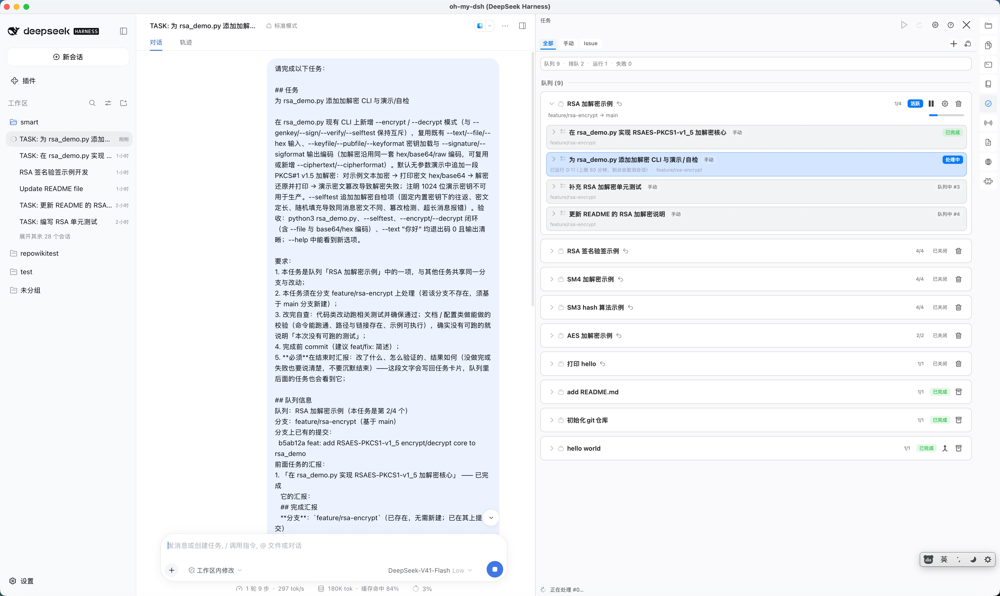
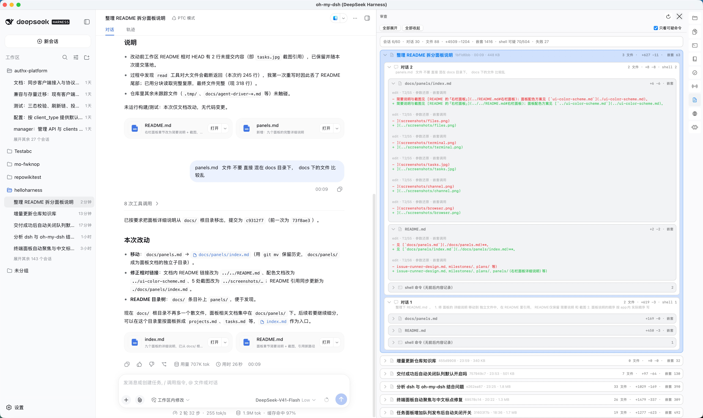

# 右栏面板详细说明

本文是 oh-my-dsh 右栏**十个原生面板**的完整说明（特性、边界、已知限制与设计文档）。
窗口最右侧是**活动栏**（图标入口，十个面板互斥切换，**首位是「项目」**），图标自上而下的顺序与下文一致：

**项目 → 文件 → 终端 → Repo Wiki 知识库 → 需求池 → 任务 → 通道 → 审查 → 浏览器 → 技能**

简要说明与截图见 [README 的「右栏面板」](../../README.md#右栏面板)；面板配色方案见 [`docs/design/shell/ui-color-scheme.md`](../design/shell/ui-color-scheme.md)。

## 项目面板（`⌥⌘P` / 活动栏首位「项目」图标）

把「工作区 = 一个目录」变成壳层里的一等公民：**在面板里建目录、再用六个面板就地打开它**。

- **项目根目录可配置**：默认 `$DSH_HOME/oh-my-dsh/projects`（开发版 `~/.dsh-dev/…`），面板头部「更改…」或设置窗口的「项目」区块都能改（存 `oh-my-dsh/shell/config.json` 的 `projectsRoot`）；**只有新建工作区时才会创建目录**，单纯打开面板不写盘；
- **新建工作区**：只输入目录名（如 `abc`），面板 `mkdir` 后调 dsh 的 `workspace/create` **幂等注册**——注册失败（dsh 未起来 / 旧版本）只标「未注册」，目录保留，之后在卡片上点「创建 dsh 工作区」重试即可；
- **每个工作区一张卡片**：名称 + 徽标（已注册 · N 个会话 / 未注册）+ 标题行右侧的**那一个 dsh 动作按钮**；第二行是路径紧跟着「在 Finder 中显示 / 复制路径」两个小按钮（贴路径文本，不右对齐）；第三行是六个面板入口。面板右上角的 `folder+` 同样是「添加工作区 / Add workspace」（输入目录名即建目录并注册）。**未注册的目录不与 dsh web 联动**（点卡片/「新会话」都不可用，只在状态行提示），徽标后面显示 **folder+ 图标 =「添加工作区 / Add workspace」**（与 dsh web 同词），点它把该目录注册进 dsh；**已注册**的徽标后面则是 **+ 图标 =「新会话 / New Session」**。两种状态下**六个本地面板入口都照常可用**。已注册的卡片：
  - **文件 / 终端 / 知识库 / 任务 / 通道 / 审查** 六个快捷入口：点一下就把壳层当前工作区切到它并打开对应面板（终端 cwd、文件树根、wiki 根、任务/通道/审查的工作区一起跟着走）；
  - **新会话**（标题行 `+` 图标）：在该工作区建一条 dsh web 会话并切过去（先 `session/create { workspaceId }` 保证归属分组，被拒退回 `cwd`）；
  - **在 dsh 中打开**（点卡片名称）：复用该工作区**最近一条会话**（运行中优先），没有则新建；
  - 在 Finder 中显示 / 复制路径；
- **单一真相**：当前工作区始终是壳层的 `ProjectDirectory`（面板只做高亮）——在 dsh web 里切到别的工作区的会话，面板也跟着换根，两边不会各说各话；
- dsh web 侧边栏有延迟时（刚建好的工作区/会话）：面板先 nudge 客户端、桥内部重试、再补一次；**始终不会自动重载页面**——定位不到时在状态行说明原因（侧栏现场会写进 `app.log`），由你决定手动刷新。

## 文件面板（`⌥⌘F` / 活动栏「文件」图标）

点击 dsh web 对话中的文件链接（`read`/`write`/`edit` 工具行、「Files changed」产出文件行，以及 turn 末尾 `present` 交付文件卡片）不再由 dsh 自带侧栏或系统默认应用打开，而是在壳层文件面板内预览。

- 面板**左侧是项目目录树**：自动定位当前项目目录，目录可展开、点文件即预览，树宽可拖拽**并被记住**（关闭面板再打开、切到别的面板再切回来都不会丢，也不会被框架重排挤成上限宽度）；
- **目录树右键菜单**：目录上「新建文件夹 / 新建文件 ｜ 重命名 / 删除（移到废纸篓，可恢复）/ 在 Finder 中显示」，**文件上不提供新建项**；重命名与删除后已打开的页签跟随改名或关闭。项目目录可用外部应用打开；
- **无后缀 / 点文件也能查看**（如 `LICENSE`、`Makefile`、`.gitignore`、`.env`）：内容可被 UTF-8 解码且非二进制即按文本预览；
- **代码 / 文本支持编辑**：UTF-8 且 ≤2MB 的文件可在面板内直接编辑，左侧**行号栏**随滚动严格对齐，头部「保存」按钮 + `File ▸ 保存`（⌘S）原子写回；未保存时页签文件名后显示 `*`，保存后消失；
- **语法高亮**：内置 highlight.js（经 vendored Highlightr，MIT），180+ 语言，明暗自适应；**大文件不再关高亮**（改为分块着色，3000+ 行照样着色且不卡 UI）；图片 / PDF / 文件夹列表 / 未知类型（图标 + 元数据）按类型预览；
- **图片预览自适应 + 手动缩放**：打开即**按比例适应窗口**（不放大超过 100%），可用触控板**捏合**、`⌘+` / `⌘−` / `⌘0`、`⌘`+滚轮、**双击**（适应窗口 ↔ 100%）缩放，放大后可拖拽平移；范围 5%–1600%、单步 ×1.25，右下角有百分比角标；
- **多文件以页签切换**，可关闭（`File ▸ 关闭页签` ⌘W）；面板头部是「**打开项目 ▾ / 当前文件 ▾**」两个菜单按钮（点开定位项目目录、切换当前文件，RPC 失败时回退手动选文件夹；「打开文件」仅在选中文件时可用），另有「保存」「在默认应用中打开」「在 Finder 中显示」「关闭」；
- **页签按工作区记忆**：在 dsh web 切换工作区时关闭并记下原工作区的页签（顺序 + 选中项），切回时按原样重开；未保存修改会先问「保存并切换 / 不保存」；
- **打开文件实时刷新**：已打开的页签在磁盘内容变化后自动刷新——代理（或任何进程）改写打开的文件时，可编辑页签经 `reloadFromDisk()` 保留滚动位置、且不覆盖未保存的本地编辑（dirty 页签跳过），只读文本 / 图片 / PDF / 元数据页签直接重渲染（与 Wiki 面板 2s 轮询刷新一致），打开即所见最新内容；**大文件（3000+ 行）改为异步读取 + 单次高亮**，磁盘变更后重新加载不再卡住应用；
- 面板宽度可拖拽并记住，且**自动保证 WebView 宽度 ≥1100pt**（dsh web 低于 1024pt 会自动收起左侧会话栏）；
- 纯 WebView 侧注入实现，不改任何 DeepSeek Harness 源码。

## 终端面板（`⌥⌘T` / 活动栏「终端」图标）

右侧打开一个**真实交互的 shell**（原生 PTY，默认 `$SHELL -l`，如 `/bin/zsh`；`TERM=xterm-256color`）。

- **多标签页**：`+` 新建 / `✕` 关闭，默认编号「终端 1/2/3…」，OSC 标题自动更新标签名；`⌘1-9` 直切、`⌘⇧[` / `⌘⇧]` 循环切换；**页签按工作区隔离并记忆**——在 dsh web 切换工作区时同步跟随，切到没有终端的工作区会自动开一个，切回来还是原来那些；
- **全功能渲染**：16/256/真彩色、`vim`/`top`/`less` 等全屏程序的备用屏与滚动区（DECSTBM），窗口缩放列数自适应（`tput cols`）；**宽字符（中文/日文/全角）按整两格排版且不变形**——用真实全角字体按两格字宽反推字号，中文标点不再被横向拉伸（等宽字体的 CJK 回退字宽只有约 0.8–1.6 格，不处理会和光标/后续文本错位），光标跨整个宽字符（聚焦时画蓝色实心块，失焦时改画蓝色空心框）；
- **编辑体验**：**鼠标移入终端即取得输入焦点**（直接打字，无需先点一下）；鼠标拖拽选中 + `⌘C` 复制（无选区时 `⌘C` 发 SIGINT）、`⌘V` 粘贴（多行走括号粘贴，不会误执行）、`⌘A` 全选、`⌘K` 清屏、触控板滚动查看历史（方向与其余面板一致，带惯性）；**双击按词选中**，可在设置菜单里打开「终端：选中文本即复制」，选中即进剪贴板；
- **输入法直输**：原生 `NSTextInputClient` —— 中文/日文/韩文等输入法的候选窗跟随光标，预编辑（拼音）文本在光标处内联显示，回车/空格上屏直接送进 shell（不再需要 `⌘V` 粘贴）；
- **输入法自动切换**：终端获得键盘焦点时自动切到英文（ASCII）输入法，并记住你原来的输入法；失去焦点（含切走 App）后自动还原最初的那个。与焦点光标同一时机：聚焦实心 + 英文，失焦空心 + 还原。使用中可随时手动切回中文（不被打断）；原本就在英文时不接管，保持你手动切换的结果；只在焦点变化时切一次，短暂抖动由 0.12s 防抖兜底；
- 输入 `exit`（或 `⌃D`）正常退出并自动关闭标签页（最后一个标签退出则收起面板）；异常退出保留「会话已结束 + 重启」以便查看错误；
- 新会话默认在**当前 dsh 会话的项目目录**启动（服务就绪后解析，失败回退用户主目录）；退出 App 自动终止所有会话；
- **已知限制**：组合表情/零宽连接符按近似宽度渲染、会话不跨 App 重启保留。

## Repo Wiki 知识库面板（`⌥⌘W` / 活动栏「知识库」图标）

让 dsh 代理维护一份**随代码演进的结构化 markdown 知识库**（`.dsh/wiki/`，可随仓库提交/共享），新会话不再盲目重新探索代码库。

- **生成/更新**：右上「+」一键让 dsh 代理执行 `repo-knowledge` skill（App 启动时安装到全局 `$DSH_HOME/skills/repo-knowledge/SKILL.md`）——初始生成（index/overview/architecture/modules/data-model/conventions/tasks）或增量更新（只重写受影响页面）；经 `session.create` + `session.prompt`（queue 模式）触发，不阻塞对话，生成会话在 dsh web 左侧可见、可取消；状态条显示进度；
- **浏览**：左侧页面树（分组、过期/手动徽标）+ 右侧渲染后的 markdown（标题/粗斜体/代码/列表/链接，软换行保真）+ 反向链接区 + `dshwiki://` 页内跳转；标题过滤搜索；
- **维护**：陈旧检测（页面 `sources` 比 `updated` 新 → 标 ⚠）；`manual: true` 页面代理绝不覆盖（标 ✎）；可选写入项目根 `AGENTS.md` 注册块（设置开关，默认关）；「自动更新知识库」（默认关，≥3 页过期且 index 超 1 小时才触发，每小时最多一次）；wiki 根目录可选「仓库内 `.dsh/wiki`」或「`DSH_HOME` 私有」；
- **提交**：生成更新完成后自动 `git add .dsh/wiki` + commit（不 push；维护代理主提交，`WikiAutoCommit` 兜底）；
- 设计文档：`docs/design/panels/repo-wiki-design.md`。**已知限制**：v1 搜索为标题过滤（无正文/语义检索）；知识由代理生成，质量取决于 dsh 代理能力。

## 需求池面板（`⌥⌘I` / 活动栏第 5 位「需求池」图标）

AI 原生工作流的**前端三件**：想法收件箱、需求池、拆解器。需求与事项状态落在项目 `.dsh`（随仓库提交），面板只是它的工作台。

- **想法收件箱**：两条路径——① **面板**：头部「＋」打开**抽屉**，一个输入框里**首行写标题、其余行写诉求**（`⌘↩` 或「创建」），落成 `.dsh/requirements/REQ-*.md`（`state: candidate`）；② **agent 对话**：在会话里说「把这条想法落成需求」或运行 `/requirement-pool 记一条需求`，agent 经 `POST /api/requirements/create` 落卡（不手改文件）；
- **需求池**：每个需求一张卡片，显示**有效状态**（候选 / 评估中 / 挂起 / 丢弃 / 已拆分 / 已关闭；派生优先级 `discarded > closed > split > state`）、来源与更新日期，以及拆出的子事项（`WS-xxx 阶段`，点击在文件面板打开）；
- **状态菜单**：卡片上的「状态」写回人工能判断的四档（`candidate` / `evaluating` / `suspended` / `discarded`）；`split` / `closed` 是**派生谓词**，不写字段；
- **拆解器**：卡片「拆解」把交接提示词（含 `POST /api/requirements/breakdown/propose` 的调用）**直接发送到当前对话**，由 agent 出「1 需求 → 1..N 事项」方案（**没有打开的对话 / 发送失败时回退复制**，人工粘贴）；方案以**待确认提案**显示在卡片上；
- **人工确认门**：只有面板上的「确认拆解」会真正建 `WS-*.md`（`requirement` 指回需求、`stage: planning`）并留下需求 → 事项映射表；「驳回」清掉提案。agent 绝不调 `confirm`（R10）；
- **使用说明**：右上角 `?` 始终可打开「需求池使用说明」抽屉（**创建需求 / 拆解事项** 两节，每节分「在面板」「在对话」两条操作）；**池为空时同一份说明直接铺在内容区**，不用先点帮助；
- **已知限制**：`closed` 只读卡片里 `delivery.outcome` 的派生缓存、不联网；PR 状态的网络派生仍由 `node .dsh/tools/derive-status.mjs` 完成（见 [手动模式使用说明](ai-native-workflow-manual.md)）；
- 设计与 API 契约：`docs/design/panels/requirements-pool-panel-design.md`；存储 schema：`docs/design/panels/requirements-workstream-store-design.md`。

## 任务面板（`⌥⌘J` / 活动栏「任务」图标）

任务台：**手动任务 + GitHub issue** 两种来源、**队列（泳道）** 串行执行，全部以**卡片**呈现。

- **卡片列表（布局对齐审查面板）**：内容区**第一行是统计卡**——整宽圆角卡里一行 `队列 12 · 排队 5 · 运行 1 · 失败 1`，**只有失败 > 0 时那一段变红**；其下每张任务卡的**标题与两枚徽标在同一行**（任务名**前面**一枚行标 `checklist`、**后面**是来源徽标 `Issue #12` / `手动`、最右是状态徽标：待处理 / 队列中 #n / 运行中 / 已完成 / 失败 / 已取消 / 已关闭），下一行是「标签 · 分支 · PR」元信息；**点卡片展开**详情（队列名 / 会话 / 错误 / 任务正文）与操作按钮（主操作 + 编辑/删除图标按钮）；标题行第二行标出当前工作区（GitHub 仓库显示 `owner/repo`；git 仓库没有 GitHub 远端显示 `目录名 · 非 GitHub 仓库`；目录根本不是 git 仓库则显示 `目录名 · 非 Git 仓库`，太长会省略号截断、悬停看全文），其下一行是来源筛选**扁平页签**（**全部 / 手动 / Issue**——手动排在 Issue 前面，顺序由 `TaskSourceFilter.allCases` 一处定义、标题也从它生成）——与技能面板同一套页签体例，判据由纯模型 `TaskSourceFilter` 给出：**泳道按「里面有没有这个页签认的任务」出现**（全部 → 不落下任何一条泳道；手动 → 用户自建的泳道都在，加上装着手动任务的自动队列；Issue → 只有装着 issue 任务的泳道）；**非 GitHub 工作区里 `配置 GitHub Token` / 刷新 Issues / 全部处理 三个按钮置灰**（它们本来就 guard 掉了 repo，点了不会有任何反应），tooltip 说明原因；卡片宽度撑满列表，窄面板下自动让位（标题/徽标截断），hover 提亮，选中（展开）与运行中各有一档强调边框；**队列是一块容器、卡片语法与审计面板同源**：泳道 = 抬起档（白）容器、队内卡片 = 下沉档（浅灰）、未入队卡片 = 抬起档，全部只有一条发丝描边（状态不再染边框，队列活跃 / 失败 / 已完成只看徽标）；卡片与队列头都用 chevron 符号开合，展开态不改底色或边框（只有**运行中**的卡片用审计面板「当前会话」那套 accent 淡填充 + 边框强调），因此"哪些任务属于这个队列"一眼可辨——队列头两行：名称 + 进度 + 状态徽标 + **图标按钮**（开始 / 暂停 / 开 PR / ⋯），下一行（展开时）是分支 → 基线 + 进度条 + 失败数；
- **手动任务（全程不弹对话框）**：页签行右侧的 **「＋」图标按钮**（空态里另给文字按钮「新建任务」）把一张**表单抽屉从内容区顶部下拉出来**（抽屉背后有一层**虚化背景**：`NSVisualEffectView` 模糊并压暗列表，抽屉与内容区因此分层）——**只有一个内容框：首行是任务标题，其余行都是任务描述（发给代理的指令），只有一行时这一行同时是两者**（`⌘↩` 创建、Esc 关闭），`创建` 后落在**未入队**区并**保持打开**（可连续录入，`完成` / Esc 关闭，抽屉滑回）；`编辑` 打开同一张抽屉并预填原值。**「新建队列」图标按钮（▣＋）**在同一个位置：队列名 / 分支（留空按队列名派生 `feature/<slug>`，中文名回退 `feature/queue-<id 前4位>`；想「就在当前分支上干」就勾上旁边的**「不切分支」**，非 git 工作区的新建表单默认就是它）/ 基于分支 / 队列完成后自动开 PR；卡片上的 **「加入队列 ▾」是和文件面板「打开项目 ▾」同一个下拉控件**（图标 + 文案 + chevron，菜单落在按钮正下方），**第一项固定是「新建队列…」**，其后才是已有队列 —— 选它新建的队列会**顺手把这一个任务入队**；队列头的**三个操作直接在行上**（图标按钮）：`gearshape` 队列设置（同一张抽屉改队列名/分支/基于分支/PR 开关）、`checkmark.circle.fill`/`circle` 完成后自动开 PR（**非 GitHub 工作区整块不显示**，已开着则显示但不可点并说明原因）、`trash` 删除队列；**`arrow.up.right.square` 打开 PR 永远在这一行的最右**（已经有 PR 时那一格就是 PR 链接），**打开 PR 只在队列头上**：卡片上的主按钮不再有「打开 PR」（用户 2026-09-27：PR 是队列跑完后由那个专门的会话开的，打开它自然也在队列那一行）——完成的 **issue 任务**主按钮是「打开 Issue」，完成的**手动任务没有主按钮**（没有任何待办动作，汇报就在详情里）；**只保留破坏性操作的确认框**（删除任务/队列、评论并关闭 issue）；**运行中/已完成的任务与 github 任务不可编辑删除**（2026-09-27 起代码与这句话一致了：还留在板上、还可能再跑的任务 —— 未入队 / 队列中 / 失败 / 已取消 —— 才有 编辑 / 删除，已完成的是**记录**）；**已完成的队列连 `gearshape` 队列设置与 `trash` 删除都没有**（改了设置也不会再跑），队列名与任务名前各有一枚**行标**（`rectangle.stack` 泳道 / `checklist` 任务，静态的第三档灰，紧挨名字）；
- **交接简报：一任务一会话，但队列里的下一棒知道上一棒做了什么**。每个任务一条自己的会话（上下文小、审查/取消/会话名都是任务级的），代价是"不连续"——所以队列里**第 2 个任务起**，提示词里会带一段 `## 队列信息`（与「交付会话」同一套字段、同一个抬头）：队列与位次、分支与基线、分支上已有的提交、前面每一棒的标题/结局（含**失败与被取消**的）、**它在自己会话里的最后一段汇报（原样，不截断）**，以及分支上相对基线已有的提交列表（`git log --oneline`），末尾明确要求「不要重做已完成的部分，只做本任务」。汇报由壳层已有的会话日志通道取出（`ohmy-core brief report <sessionId>`，复用 `core/lib/review-log.js` 的解码能力，读 `$DSH_HOME/sessions/...`）。读不到汇报时简报会写明「它没有留下汇报」，而不是假装上一棒什么都没说。
- **跨工作区作业台（2026-09-27 起）**：每个**有任务在跑**的工作区各自持有一个 runner —— **切到别的项目不再放弃跟踪**（此前切走会把正在跑的任务标成「上次运行被中断」，而它的 dsh 会话其实还在后台干活、跑完也没人更新卡片）。git 按工作树串行，所以不同工作区可以**同时**跑（A 改代码、B 跑测试互不干扰）。配套的三件可见性：① 活动栏小点表示「**任意**工作区在跑」；② 面板头部多出一个只在「别的工作区有任务在跑」时出现的图标，悬停列出「工作区 — 任务标题」，点开选中即把壳层切过去；③ 任务结束的提醒（Dock 弹跳 + 日志）里带**工作区名**。工作区只在**本次运行第一次加载**时对账（reconcile「上次运行被中断」），重复重建不再误判；空转的工作区会被放下（板子在磁盘上，切回去即重建）。
- **跑起来之后看得见**：活动栏「任务」图标在运行中带一个角落小点；任务在后台结束时 Dock 图标弹一下并留角标（聚焦即清，用户主动取消的不打扰）；运行中的卡片 meta 行第一项是**已运行时长**（`1:05` / `1:02:05`）；展开卡片可**直接打开该任务的会话**（`arrow.up.forward.app`，切到 dsh web）或**审查这次改动**（`doc.text.magnifyingglass`，把该会话交给审查面板；tooltip 就是「打开会话 / 审查改动」这两句短话）——此前卡片上的「会话：xxx」是死文本，两个按钮的 tooltip 也长到读不完；**点了立刻有反应**：状态行先说「正在打开会话…」，定位失败时**把原因说在这个面板的状态行上**（此前失败只说给项目面板听，用户在这个面板里看到的就是「点了没反应」），而且查找用的「正在打开」标记带超时（一次没回话的 bridge 调用不会再永久吞掉同一个会话的后续点击）；重启后被中断的任务与暂停的队列会用状态行说明一句，不再只写日志。
- **「全部处理」不再只管 issue（2026-09-27 起）**：它的语义是「把所有还在等的任务跑起来」——**每个任务各自一个单任务队列**（一条分支、一个 PR，和 issue 任务的形状一致），按板面顺序串行推进；issue 需要 GitHub，手动任务任何工作区都能跑 —— **包括不是 git 仓库的目录**：那里队列不设分支（流水线完全不碰 git，提示词只说壳层那一半「不会切分支、不会提交、不会推送」，**任务自己要求建仓库／提交时照做** —— 见下面「提示词按工作区的形状写」），已有的坏队列在重试时会被就地修好。批量 >1 时先确认，**确认框里写清这一步要做什么**（N 个任务各自一个队列与一条分支、串行执行、是否开 PR；非 git 目录则说不切分支也不开 PR）；按钮的 tooltip 只说这个按钮做什么（图标按钮没有文案，只能靠它），禁用时才多一句「没有待处理的任务」。可用性从「有没有 GitHub 仓库」改成**「有没有待办」**（没有待办就禁用，顺带修掉此前「点了没反应」的死点击），按钮挪到工具栏**第一位**（它才是这个面板的主操作）。**批量收的是「自己站着的」任务**：未入队的（`.pending`），加上**队列被删掉之后的失败 / 已取消任务**（它们回到未入队、卡片上只剩「加入队列」一个一个点，批量正该带上它们）；**仍在队列里的失败任务不归批量管** —— 那是泳道自己的事（重试 / 跳过并继续），全局批量不去悄悄复活一个被暂停的队列。
- **基线分支问 git，不写死 main（2026-09-27 起）**：采纳工作区时探测它的默认分支（推送远端 `github`>`origin`>首个远端的 `HEAD` → 本地 `main` → 本地 `master` → 当前分支 → 兜底 `main`），issue 任务的自动队列与队列表单的「基于分支」都用它——此前一律 `main`，默认分支是 `master`/`develop` 的仓库**第一个 issue 任务必然失败**（流水线第一步 `git checkout main`）。
- **任务超时 60 分钟且写在卡片上（2026-09-27 起）**：此前硬编码 30 分钟、悄悄掐掉长任务。现在默认 **60 分钟**，运行中的卡片直接显示「已运行 1:05（上限 60 分钟，到点会取消会话）」；需要更长可在壳层设置里覆盖 `tasksTimeoutMinutes`（5–1440 之间的整数，`~/.dsh/shell/config.json`）。
- **队列 = 泳道**：同一队列的任务**共享一个分支、按 FIFO 顺序执行**（后一个任务看得到前一个的 commit —— 依赖关系由分支累积表达）；**全局严格串行**（一个工作树一次只能在一个分支上）；队内失败/取消**暂停该队列**，卡片给「重试 / 跳过并继续」；**队列被删除后**，失败任务卡片的主操作直接变成「加入队列」（issue 任务则是「处理」）——已经没有队列可以重试进去了，不会再出现「点重试只是把卡片重置一次、再点一次才出现加入队列」的两跳；切到另一个队列前要求工作区干净（脏工作区拒绝启动并提示）；
- **issue 任务**：点「处理」自动建一个**单任务队列**（分支仍是 label 判定的 `feature/issue-N` / `fix/issue-N`），保留 v1 的「一 issue 一分支一 PR」；「全部处理」给每个 pending issue 各建一个，串行依次跑；
- **issue 任务与手动任务对齐（2026-09-27 起）**：两种来源现在**共用同一份提示词要求**（`TaskPrompts.requirements`），只有「头」不同 —— issue 头给**编号 + 标题 + 标签 + 正文**（此前只给标题，正文还得代理自己去 GitHub 拉），手动任务头给标题 + 描述。于是：issue 任务同样**只 commit、不提 push/PR**（旧版因为提示词指向 `issue-resolve` 技能、而技能停在「任务自己 push、面板开 PR」的旧政策里，同一个面板里两种行为）；要求条目同样按工作区形状出现（非 git 目录没有分支条、非 GitHub 没有 token 条）；同样带队列交接简报。自动队列的形状也统一：非 git 目录里 issue 任务的单任务队列**不再派生 `fix/issue-N`**（此前写死分支，任务必然 `errNotGit`），旧队列带着切不了的分支时启动前先去掉。`issue-resolve` 技能随之**退役**（App 启动时删除受管的旧副本，用户自己改过的保留）；
- **任务只 commit，push 与 PR 交给一个专门的「交付会话」（2026-09-27 起，第二轮）**：任务会话**只做本地 commit** —— 提示词里没有 push、没有 PR、没有「远端必须有这些提交」，也没有任何推送校验（旧版会因为「分支不在远端」把干完的活判成 `tasks.errNoPush`，那条路连同 `ls-remote` 检查一起删了）。队列**全部任务跑完**、且队列开着「完成后自动开 PR」、工作区有 GitHub 远端时，壳层**另起一个会话**：它先看这个分支到底改了什么（`git log/diff`），自己写 PR 标题与正文（要的是**总结**，不是模板），推送分支、开或复用 PR，并在最后一行给出 PR 链接 —— 壳层从它的汇报里读出链接写回队列（读不到就查这个分支上已有的 PR 兜底）。这个会话在 dsh 里就叫「交付：<队列名>」，可以像别的会话一样打开看。队列头的 `交付` 按钮走的也是这条路（不是直接调 API）；失败时原因落在队列上并显示在按钮 tooltip 里（`tasks.errPR` / 无分支 / 无远端 / 会话起不来），队列保持「已完成」，不会把一个 PR 失败算成任务失败。
- **交付成功后自动关闭队列（面板设置开关，按工作区）**：任务面板设置抽屉里新增一个复选框；开启后，队列的交付会话成功交付（PR / 合并 / 推送）时自动把队列置为「已关闭」（任务、分支与 PR 记录保留）——PR 以拿到链接为准，merge / push 读交付汇报里「已合并 / 已推送」的结果行；汇报读不出成功、或队列停在「已暂停」（有失败任务）时不关。开关**按工作区隔离**，存 ShellConfig 的「工作区路径 → 布尔」映射 `tasksAutoCloseOnPublishByWorkspace`，未设置过的工作区默认关；和其他设置项一样，一个工作区的选择不会泄漏到别的工区（抽屉说明也明确「只对当前工作区生效」）。
- **汇报回写到任务卡片（2026-09-27 起）**：每个任务结束（成功或失败）时，壳层把代理在会话里的**最后一段文字**取出来写到任务上（`TaskItem.report`，落在 `local.json`，不进随仓库走的 `manual.json`/`index.json`）——卡片详情里多一行「汇报」，队列里**下一棒的交接简报优先用它**（会话被删掉也还在），点「重试」会清掉上一轮的汇报（它不是这一轮的结局）。提示词里那条因此是**必须**：「**必须**在结束时汇报：改了什么、怎么验证的、结果如何（没做完或失败也要说清楚）」——这段汇报现在真的会被用起来。
- **提示词按工作区的「形状」按需出条目（2026-09-27 起）**：面板把工作区分成**三态**（`TaskRepoShape`：非 git 目录 / git 仓库但没有 GitHub 远端 / GitHub 仓库），并在**写提示词的那一刻**重新探测（不是 adopt 时抄下来的那份）——同一个队列里第一个任务跑了 `git init` 或 `git remote add`，第二个任务的提示词说的就是新状态。要求列表不再是写死的 1–6 条，而是**按状态决定哪些条目出现、编号连续**：非 git 目录**没有分支条**（`git init` 建了仓库才 commit）；有仓库才有「完成前 commit」与分支条（有分支的写「本任务须在分支 X 上处理（若该分支不存在，须基于 base 分支新建）」，不切分支的写「本队列不切分支：直接在主分支 base 上处理」——两条都点名分支，`TaskPrompts.manual` 因此多了个 `base` 参数）；**token 条只在 GitHub 仓库出现**；「改完自查」一条同时照顾代码与文档（没有可跑测试的就说明）；「汇报」一条每个任务都要。
- **PR**：**队列最后一项完成时**由它的「交付会话」创建（先查该分支已有的 PR 复用，避免 422）；开不出来**不算任务失败**——原因落在队列上、按钮 tooltip 里说清楚，可以点「交付」再来一次；工作区不是 GitHub 仓库（公司内部远端）时 PR 能力自动关闭，那个队列也就不起交付会话（见上两条）。
- **失败处理**：脏工作区 / checkout / pull / 建会话 / 提示词 / 超时（60min）各有明确原因（存的是 L10n 键，随界面语言显示），可重试；取消走 `session.cancel`；**目录不是 git 仓库时也能跑任务**——不切分支的队列全程不碰 git，在非 git 工作区新建队列默认就是「不切分支」；万一队列设了分支而目录没有仓库，任务以「当前工作区不是 git 仓库」失败，卡片主按钮同时变成**「不切分支并重试」**（点一下清掉该队列的分支再重跑），不用自己去队列设置里绕；
- **Agent 也能建任务（技能 `task-todo`，2026-09-27 起）**：壳层常驻的 localhost REST API 上多了一组 **`/api/tasks/*`**（`GET /api/tasks/task/list` / `POST /api/tasks/task/create`，一次可建多条），端口发现文件 **`~/.dsh/oh-my-dsh/shell-api.port`**（与 `browser-api.port` 同值、同一个服务）；配套**内置技能 `task-todo`**（App 启动安装到全局 `$DSH_HOME/skills/task-todo/SKILL.md`）让代理在**用户明确要求**时把沟通好的需求与方案**批量**落成手动任务（每条 = 标题 + 给执行者的描述）。落盘走的是面板自己的那条路（`TasksRunner.createManualTask`，经主线程串行），任务一律「**待处理、未入队**」——**建任务不启动任何东西**，队列与运行仍由用户决定；默认 `focus: true` 让面板切到那个工作区并展开，用户立刻看见卡片（状态行同时说明「已由 Agent 创建 N 个任务」）。2026-09-30 起还能**建「等待态队列」并批量入队**（`POST /api/tasks/queue/create`，队列以 `.draft` 待启动），队列**跑到 `.done`** 时把各任务完成情况（汇报首行 / 失败原因 / PR）**回传创建它的会话**（技能带上 `$DSH_SESSION_ID`；回传文案要求代理只简短确认、不主动改代码）；失败或手动取消让队列停在 `.paused`，不回传。启动有两条路：会话里说「启动队列」（技能调 `POST /api/tasks/queue/start`）或面板点「开始」，两者都不改变创建时记下的队列↔会话关联。跑完之后还能**交付**：会话里说「交付这个队列」（技能调 `POST /api/tasks/queue/deliver`）就按队列的 Git 工作流（开 PR / 合并到基线 / 直接推送）起一条交付会话，结果回写到队列卡片；技能只在用户明确要求、且队列**已完成**时才交付。技能**默认**建「等待态队列 + 入队」，只有用户明确说「只建任务 / 先别入队 / 不要队列」时才只建裸任务；
- **重启恢复**：读 `.dsh/tasks/` 四文件（`index.json` 提交的 issue 关联 / `manual.json` 手动任务 / `queues.json` 队列 / `local.json` 本机 task↔session，兼容 v1 的数字键），上次运行中的任务标为「已中断」、**活跃**队列暂停（**等待态 `.draft` 不在此列，仍是待启动**），**恢复后不自动开跑**；

- **GitHub token（按仓库作用域，只走文件）**：面板「配置 GitHub Token」**只写文件** —— 有当前仓库时写文件专属 `~/.dsh/oh-my-dsh/tokens/<owner>-<repo>`，否则写通用 `~/.dsh/oh-my-dsh/gh-token`（均 chmod 600，App 与外部工具/代理共用）；解析优先级：文件专属 → 文件通用；**不再读写 macOS 钥匙串**（旧版写在钥匙串里的 token 需重新填写一次）；公开仓库无需 token，私有仓库拉取/开 PR/评论关闭需要；
- 工作区非 GitHub 仓库时诚实显示空态（不替换为其他已注册工作区）；切换到不同仓库先清空旧列表再重载。

## 通道面板（`⌥⌘H` / 活动栏「通道」图标）

把微信个人号或钉钉机器人接入 dsh，**在微信/钉钉里远程驱动 dsh 干活**：发消息 → 路由到项目会话 → 结果回复回原平台。微信走官方 iLink 协议、钉钉走 dingtalk-stream 原生适配器，两平台与微信共享同一套面板模型（扫码向导 / 连接状态 / 项目视图会话消息 / 每会话跨项目路由）。

- **接入向导**：内置平台卡片（微信 ClawBot / 钉钉 / 飞书，带实时连接状态徽标）；微信扫码登录**在面板内渲染二维码**（不弹浏览器），登录态落 `~/.dsh/oh-my-dsh/channels/<id>.json`（文件优先，chmod 600），微信绑定页展示**已配置状态 + 显式「重新登录」**（避免误替换已绑定的 token）；钉钉走 **device-code 扫码向导**（`init/begin` 得二维码 → 面板内渲染 → 手机钉钉扫码自动创建企业内部应用+机器人 → 本地轮询 `poll` 拿 AppKey/AppSecret 写入 store，chmod 600），已配置通道不重复扫码、重开向导自动恢复 `/bind` 口令；
- **项目视图**：当前项目可用通道开关（启用状态存全局 `~/.dsh/oh-my-dsh/channels/<channelId>.workspaces.json`，project=workspace，见 `docs/design/channels/channel-project-switch.md`）。开关**真正门控路由**：普通消息 / `/new` 路由到未启用该通道的 workspace → 回「该项目未启用该通道」、不建会话；`/workspaces` 只列已启用项。会话列表：通道标题行展示「图标 + 平台名 (channelId) + 会话数」、启用开关靠右，整行独立背景；每条会话独立区块，标题可点开/收起，消息按对话气泡展示（提问靠右、回复靠左）；顶部「全局配置」随时重开；
- **通道内斜杠指令**（微信 / 钉钉共用）：`/help` `/ping` `/status`（全局）；工作区指令 `/workspaces`(`/wks`)、`/sessions`(`/ses`)（无内容列出 / 有内容切换，等同 `#wN`/`#sN`）、`/new [内容]`（统一回 `创建新会话 #sN (sessionId)`，无内容建占位 `New Session`（dsh 标题由 dsh web 按首条消息自动命名）等首条消息激活、有内容 prompt=内容并回推答案）；快捷指令 `#w1`/`#s1…`（切项目/会话，均按目标/当前 workspace 是否启用该通道**门控**：未启用回「该项目未启用该通道」）与 #tag 路由（如 `#w1 帮我看看`）；
- **消息分发**：路由优先级（显式会话绑定 > 关键词 > 默认兜底），未绑定项目回复提示不静默；同会话串行、跨会话可并发（jobqueue）；
- **钉钉专属（owner-binding 安全门）**：`/bind <口令>`（口令本机生成、见面板或运行日志）——未绑定管理员前**拒绝所有人**，仅绑定管理员可驱动本机 dsh（防任何组织成员经机器人操作本地 bash/文件/token）；绑定成功回两条消息（确认 + 完整 `/help` 输出）；绑定状态存 `~/.dsh/oh-my-dsh/channels/<channelId>.binding.json`（chmod 600）；钉钉无「正在输入」，以文字 ack 代替 sendTyping；
- **会话驱动**：conversationId → dsh 会话映射（多轮对话续接，`/new` 另起），`/new` 后绑定会话到 conversation、下一条普通消息复用而非新建；经 `session.create` + `session.prompt`（queue）驱动，**生成时回原生「正在输入…」(微信 sendTyping / 钉钉文字 ack)，完成后回推答案**；
- **可靠性**：官方 iLink 协议**严格串行长轮询**（修复重复回复）；断线/鉴权失效（-14）归一到统一状态机，受控重连/重新扫码；启动自动拉起 listener、退出清理、同通道去重；
- **实时刷新**：项目视图在对话回复后 **~1.5s 内自动更新**——轻量重读全局 store，仅当内容签名变化时全量重建（保留折叠/展开状态），不随轮询抖动；
- **与 dsh web 会话双向联动**：点击项目视图会话行（单一手势）同时展开/收起其消息并**定位到 dsh web 对应会话**（经注入的 `sessionOpenerScript` 驱动）；反过来在 dsh web 切换会话时，面板自动展开对应会话、其余行收起（无对应则会话列表保持可见、仅全部收起）。**以 sessionId 对应、不用 name**（name 会因 `/new` 重绑/标题变化失配）；设计见 `docs/design/channels/channel-web-session-link.md`；
- **全局存储**：会话映射与消息日志归档到全局 `~/.dsh/oh-my-dsh/channels/`（按 channelId/workspaceKey/sessionId 分桶）；「项目开关」关联存全局 `~/.dsh/oh-my-dsh/channels/<channelId>.workspaces.json`（见 `docs/design/channels/channel-storage.md`、`docs/design/channels/channel-project-switch.md`）；
- **当前限制**：飞书仅展示卡片（适配器待实现）；钉钉富特性（AI Card 流式 / 互动审批卡 / 图片 / DWS）留作后续增强，v1 以文本/Markdown 回复为主；
- 设计与指令清单：`docs/design/channels/channel-design.md`、`docs/design/channels/channel-dingtalk-stream.md`、`docs/design/channels/channel-commands.md`、`docs/design/channels/channel-status.md`、`docs/design/channels/channel-project-switch.md`。

## 审查面板（`⌥⌘R` / 活动栏「审查」图标）

**只读**回答「这个会话里代理到底改了哪些文件、改成什么」——直接读 dsh 自己落盘的会话日志（`$DSH_HOME/sessions/<workspace>/<session>/session[.vN].jsonl[.zstd]`；日志文件名里的 `.vN` 是 dsh 的 **Session 格式世代**，dsh 0.1.5 的新会话是 `session.v3.jsonl`，面板按规范名枚举并**取世代最大的那一份**），不写任何文件、不发任何请求、不改 dsh。

**按 会话 → 对话（turn）→ 文件 → 变更内容 的树展示，每层可展开/收起**；对话用该轮的用户消息做摘要；
会话在第一次展开时才真正审计（列表只读日志头，展开才解码全量日志）。**审计结果会跟着日志走**：正在对话的会话
日志一直在追加，面板按日志身份（大小 + mtime）判断有没有新内容——面板在屏上时每 5 s 做一次 `stat`，只有真的变了
才重读一次，所以新建会话里刚改的文件会**自己出现**，不需要重开面板或点刷新。

- **每个文件的逐次改动**都标出该条记录**从哪来**：
  - `已应用` —— 顶层 `write`/`edit` 工具结果里的 hunk（与 dsh web 的 diff 卡片同源）；
  - `参数还原` —— 由调用参数还原（`run_code` 嵌套调用没有 hunk 元数据）；
  - `全文写入` / `新建` —— 只记录了写入内容（新建文件没有「旧内容」可比）；
  - `嵌套调用` 标记 —— 该改动来自 `run_code` 内部的工具调用；
- **shell 命令单列**：`bash` 直改（`sed -i`、`>`、`rm`、`git checkout` …）没有结构化的前后内容记录，面板按「可能写文件」启发式标出，默认只显示可疑项（可关掉过滤看全部）；
- **失败调用单列**：记录为「尝试但未生效」的改动不混进变更列表；
- **跟随 dsh web**：在 dsh web 切换会话时，面板展开同一 sessionId（按 id 解析，跨工作区也能定位），并标为「当前会话」；工作区切换只重列会话、不清审计缓存；
- **读取诊断**：Zstandard 尾部未完成帧、无法解析的行等一律显式列出（不静默丢数据）；
- **只读边界**：日志里没有的东西不会显示——`bash` 直改、以及日志**尚未落盘**的部分只标注「需人工核对」（落盘后会自动读到，见上）；
- 设计与覆盖矩阵：`docs/design/panels/review-panel-design.md`。

## 浏览器面板（`⌥⌘B` / 活动栏「浏览器」图标）

**多标签嵌入式 Chromium 浏览器**（CEF/Chromium 内核，每标签一个渲染进程），面向开发调试 web 页面与 Agent 排查网页问题。

- **多标签**：`+` 新建 / `✕` 关闭 / `⌘1-9` 切换，上限 8 个；地址栏导航（无 scheme 自动补 `https://`）、后退/前进/刷新·停止、标签标题随页面更新；启动恢复上次 URL；
- **渲染**：默认 **窗口化渲染**（CEF 视图原生合成；曾误设为 OSR，1.15.0 已改回）；如确需 **OSR 离屏渲染**（每帧像素自绘），在 `$DSH_HOME/oh-my-dsh/shell/config.json` 里设 `"browserRenderMode": "osr"`；
- **Chromium 原生 DevTools**：头部「DevTools」按钮弹出独立窗口的完整调试器（Elements/Network/Console/Sources）；
- **控制台/网络日志**：经 CDP 捕获页面 console、异常与网络请求，供 REST API 读取（`eval`/`screenshot` 也走 CDP；CDP 端口默认 `9333`，`DSH_CDP_PORT` 覆盖）；
- **Agent 驱动（curl 即用）**：壳层常驻 localhost REST API（默认 `127.0.0.1:3081`，端口文件 `~/.dsh/oh-my-dsh/browser-api.port`）——`status` / `open` / `tabs` / `back` / `forward` / `reload` / `stop` / `eval` / `console` / `console/clear` / `screenshot`(PNG) / `hide`，外加 QA 端点 `debug` / `hierarchy`；Agent 驱动时面板自动展开，截图可存工作区供读图/分享；配套技能 `web-dev-tools`（App 启动时安装到全局 `$DSH_HOME/skills/web-dev-tools/SKILL.md`，model+user 可调用）开箱即用；
- **说明**：CEF 构建体积约 +320MB/架构；Chromium 使用模拟钥匙串（`use-mock-keychain`，不弹密码框、不存网页密码）；profile 数据收在 `~/.dsh/oh-my-dsh/browser/`；随包分发 5 个 helper app（base/Alerts/GPU/Plugin/Renderer）；集成细节见 `docs/plans/BROWSER_PLAN-browser-panel.md`。

## 技能面板（`⌥⌘S` / 活动栏「技能」图标）

管理 agent 技能（SKILL.md）：**已安装** 与 **可安装** 两个页签。

**已安装**：扫描 dsh 的四个技能根，按优先级去重，逐行标出级别 —— `内置` / `用户级` / `共享级` / `项目级`，同名被压住的标「被遮蔽」，并给出描述与完整路径。

- **内置技能只读**：开关禁用、无「移除」、卸载不掉（App 启动时按内嵌内容同步，内嵌与已装文件保持字节一致）；
- **共享级**（`~/.agents/skills`，外部 skills CLI 管理）：可看到、可改开关，但不在面板里移除；
- **用户级 / 项目级**：可改开关、可移除（项目级会写进用户仓库，确认框会提示）；
- **调用开关**：`用户可调用` 写 `user-invocable`、`模型可调用` 写 `disable-model-invocation`（关 = 写 true）——改的是 `SKILL.md` 的 frontmatter，dsh 自动识别，无需重启；切回默认值会**删掉该键**，文件字节还原；

**可安装**：顶部选 registry，列表就是该 registry 的技能清单；**进入即有内容** —— 有清单来源的 registry（GitHub 仓库 / well-known）直接列出清单，只有搜索接口的（skills.sh）默认显示**热门列表（按安装量降序，前 30）**，输入关键字即切换为搜索结果。

- **registry 可配置**（`$DSH_HOME/oh-my-dsh/shell/skills.json`）：`owner/repo` 或 GitHub 地址 → 列该仓库的技能清单；well-known 地址 → 读 `/.well-known/skills/index.json`；其他 URL → 视为 skills.sh 兼容的搜索接口（默认预置 skills.sh，仅有搜索，无全量清单，故无清单来源时列表区会提示「按关键字搜索」）；
- **交互**：**整张卡片可点 = 看详情**（用系统默认浏览器打开该技能的页面：skills.sh 型 registry → `https://www.skills.sh/<source>/<skill>`；GitHub → 仓库内技能目录；well-known → 该技能的 SKILL.md；本地路径 → 在 Finder 中显示），悬停时整卡有 accent 底色提示可点；**「安装」按钮只在鼠标移入卡片时出现**，移出即隐藏；
- **安装方式**：清单勾选安装 / 「从地址安装…」（`owner/repo`、`owner/repo@skill`、GitHub·GitLab 地址、well-known 地址、本地路径）/ 「手动导入…」（本地目录含 SKILL.md，或单个 SKILL.md，附件一并复制）；
- **落点**：默认 **用户级** `$DSH_HOME/skills/<name>/`（所有工作区通用），可选 **项目级** `<工作区>/.dsh/skills/<name>/`（优先级最高）；同名已存在会先确认，内置同名技能拒绝覆盖；
- **安全**：技能以完整代理权限运行，安装确认处固定提示；仅接受 https 地址，路径穿越被拒绝，失败不留半成品。

设计与机制（四档级别判定、registry 模型、开关的可逆写法）：`docs/design/panels/skills-manager-design.md`。